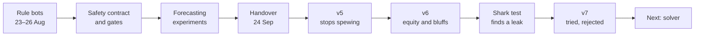
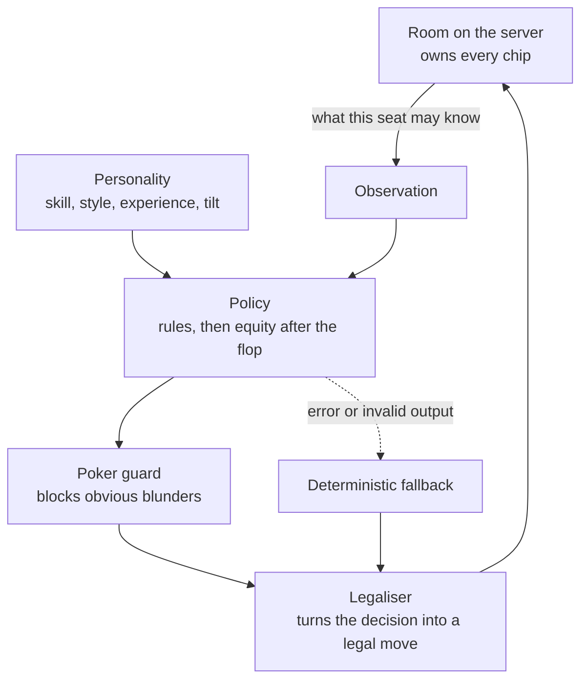
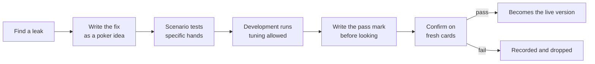

# The bots

River fills empty seats with bots so that a friend group can always get a game. They have ordinary names, and nothing on the table says which of them is strong. This is how they went from rule-of-thumb players to a bot that is measured against a perfect counter-strategy and an outside benchmark, with the parts that did not work left in.

It covers two phases. The rule bots arrived in August; Codex then wrote the safety contract around them, the scenario gates and a set of forecasting experiments, which landed on 24 September. From that day Claude took over the bots and the machine learning. Every number below comes from a recorded run, and the design documents in [`design/`](design/) hold the full write-ups.

---

## The short version

| Version | What changed | What it measured |
| --- | --- | --- |
| v4, inherited | Rule-based OG | Lost to every test style heads-up, by 76 to 101 big blinds per 100 hands |
| v5 | No bluff-raising with any two cards; a proper preflop ranking | +122.3 over v4 |
| v6, live on the branch | Hands judged by equity against the ranges opponents' actions suggest; balanced heads-up bluffing | +127.0 over v5 |
| v6 under the shark | A player who knows exactly how the bot plays | Gives up 215.9 per 100 hands heads-up |
| v7 | Defend against big bets | Rejected twice: no less exploitable |

Big blinds per 100 hands (bb/100) is the usual poker win rate. +100 means winning a big blind a hand.

---

## What a bot is

A bot is a policy the server asks for a move whenever a bot seat is to act. The policy sees what a player in that seat could legally know: its own two cards, the board, the pot, the stacks, the moves made so far this hand, and statistics about opponents built only from what the table has shown. It never sees another player's cards or the cards still to come.

Four rules have held since the first contract ([design 23](design/23-bot-policy-contract.md)): only the server submits a bot's move; a policy gets nothing its seat could not legally know; the server reduces every decision to a legal move; and a deterministic rule policy is always there as a fallback.

Characters differ along separate axes. Skill comes in three tiers: rookie, novice and OG, the strongest. Style decides how loose or aggressive a character is, experience how well it plays its style, and tilt is a bounded swing after bad beats. A table can be Casual, Mixed, Tough or Random, and Random is the default ([design 27](design/27-bot-table-presets.md)).

---

## Part one: rules, a contract and a forecasting experiment

### Rule bots

The first bots arrived with the solo session on 23 August. They were checklist players: how strong is my hand, what is the price, what does my personality say. Personalities and tilt followed on 24 August, bots taking empty seats on 26 August, then table talk and pacing, so that a bot takes longer over a hard decision than an easy one.

### The contract and the gates

Before anyone tried to make the bots stronger, the boundary was fixed in writing: the policy contract, a corpus of fixed scenarios every policy must pass, a public record of the current hand's moves, and an opponent-memory contract saying what a bot may remember about a person and how that memory decays ([design 23](design/23-bot-policy-contract.md) to [27](design/27-bot-table-presets.md)). The scenarios are concrete: an OG never folds pocket aces before the flop, and it bets the nut flush on the river at least half the time.

### Forecasting what a player will do

The first machine-learning track did not try to play poker. It tried to predict a player's next move: fold, check, call or raise, from the public state just before it. That is a four-class classifier over twenty public features, trained with plain gradient descent and tested on hands it never saw ([design 28](design/28-bot-opponent-action-ml.md)).

| Model, on held-out simulated players | Accuracy | Log loss, lower is better |
| --- | ---: | ---: |
| Learned | 75.06% | 0.5602 |
| Statistical baseline | 70.24% | 0.5672 |

Later versions added each player's own history ([design 29](design/29-bot-opponent-action-v2.md)), tried blending in live per-player rates, which made things worse ([design 30](design/30-bot-adaptive-forecast.md)), broadened the training cast and regressed on ordinary players ([design 31](design/31-bot-opponent-action-v3.md)), then switched models per player only when the evidence supported it ([design 34](design/34-bot-online-forecast-gate.md)). A server-side seam can watch real play, but it is off by default and was never pointed at real people ([design 35](design/35-bot-action-shadow.md), [36](design/36-bot-shadow-canary.md)).

The forecasts never chose a bot's move. The track's most useful output was its honesty: several negative results, recorded as such.

### Playing better, and the lesson of the river

The play-quality pass found real errors ([design 32](design/32-bot-play-quality.md)). The preflop score gave pairs such a large bonus that a small pair could outrank ace-king suited. A flush-draw shortcut treated some made hands as mere draws.

It also produced the deepest lesson of the first phase. A candidate that computed exact river equity against each opponent's starting range changed three folds into calls over 2,400 held-out hands, and all three lost. The document says why: **equity against someone's starting range is not equity after they have chosen to bet this river.** A bet changes the range. Everything in part two works around that sentence.

---

## The handover

On 24 September the bot work moved from Codex to Claude with a clear brief. Zain wanted a convincing nine-seat table with optional bots, the default strength random and the names ordinary. Skill, style, experience and tilt were to stay separate. The OG should be very strong using only legal public information, every bot move should be checked by the server, and bots should adapt to what players show without jumping to confident wrong reads. "Learning during play" was defined narrowly: small, confidence-weighted statistics about opponents, not a network retraining itself mid-game.

The build was red at the handover. The last commit depended on a file that had never been committed, so continuous integration failed on the main branch. The first commit of the new phase added it.

---

## Part two: measuring whole games

### An instrument first

A single hand of poker says almost nothing. A good decision loses often and a bad one wins often. So the first packet built an instrument before touching the bot ([design 37](design/37-bot-session-evaluation.md)).

- **Paired sessions.** The old and new versions play the same cards from the same seats with the same stacks, so luck mostly cancels, as in duplicate bridge.
- **Real conditions.** Stacks from 40 to 400 big blinds, chairs rotating, several OG characters, whole sessions of 60 to 100 hands.
- **Honest error bars.** Hands within a session are not independent, so the intervals are clustered by session.
- **Held-out opponents.** Five synthetic styles the bot is never tuned against (value, balanced, overbluff, camouflaged and reverse-sizing) plus River's ordinary cast.

The instrument had to prove it could see something before it measured anything. A version against itself reads zero. A planted leak, folding premium hands to any bet, moved the result by −185.6 bb/100 (−241.8 to −129.4).

The first real measurement was sobering. The live OG lost to every held-out style heads-up:

| Heads-up, the inherited OG | bb/100 | 95% interval |
| --- | ---: | ---: |
| value | −80.3 | −98.5 to −62.1 |
| balanced | −101.0 | −121.9 to −80.0 |
| overbluff | −86.4 | −114.7 to −58.1 |
| camouflaged | −75.8 | −97.8 to −53.8 |
| reverse-sizing | −86.0 | −109.5 to −62.4 |
| ordinary cast | −13.9 | −30.5 to +2.7 |

Premium starting hands won. Weak hands, three quarters of all deals, lost heavily.

Every change since has gone through the same path:

The pass mark is written into the roadmap before any fresh cards are dealt. It is too easy to move the goalposts after seeing a result otherwise.

### Version 5: stop spewing

The inherited OG would raise as a bluff with any two cards when facing a bet, and ranked starting hands badly. Each fix was measured on its own before being bundled ([design 39](design/39-bot-og-strategy-v5.md)):

| Change, against v4 | bb/100 | Kept? |
| --- | ---: | --- |
| No bluff-raise with any two cards | +64.7 (+52.3 to +77.1) | yes |
| Ranked preflop score | +48.2 (+29.1 to +67.3) | yes |
| Bluff-raise only with a draw or a playable hand | −19.4 (−28.4 to −10.4) | no |
| Bluff when checked to heads-up | +1.1 (0.0 to +2.2) | no |

On fresh cards the bundle beat v4 by **+122.3 bb/100 (+102.9 to +141.6)** pooled over twelve tables. The any-two-cards raise was not worthless everywhere. It won chips from players who fold too much and lost far more to aggressive ones.

v5 overcorrected, though. It never bluffed, and it judged a made hand so crudely that it folded top pair to a half-pot bet three times in four.

### Reads, and memory across sessions

Reads are the bot's equivalent of a heads-up display: counts of what each opponent does, with a confidence interval, so three hands of data cannot convince it of anything ([design 38](design/38-bot-public-opponent-reads.md)). Against a pressure player, bluff-catching on the read was worth +61.4. Over all twelve tables the read did not clear its pooled pass mark (the lower bound came out at −0.006), because one session rarely gives enough evidence.

Letting the memory carry across sessions, as a regular meets the same people on different days, fixed that. Over chains of six meetings the reads paid on fresh cards: **+6.9 (+4.4 to +9.5)** pooled ([design 40](design/40-bot-cross-session-reads.md)). Storing that memory in the database is designed and ready, but switched off until a production change is approved.

### A first learned model

The first model that chooses moves replayed decisions from simulated sessions, tried each option many times from the same spot, and learned which was worth most ([design 41](design/41-bot-learned-action-values.md)). It is a small neural network, 22 inputs and one hidden layer, trained on those simulated outcomes. It beat v5 by +44.4 (+36.0 to +52.8) on fresh cards and cleared its pass mark.

It was then shelved. It improved on v5, which v6 replaced before anyone decided to wire it in, and at about 25 ms a decision it was too slow to test against the shark below.

### Version 6: think in equity

v6 changes only what an OG does after the flop ([design 42](design/42-bot-equity-core.md)). It asks: given what this player's betting says they hold, what is my share of this pot? It bets for value when ahead, calls when the price is right, and bluffs heads-up at close to the rate that makes a call break even. A character's bluffing tendency tilts that rate within bounds, so characters differ without any of them spewing. A new hand evaluator made the equity maths 25 to 30 times faster with identical results.

Scenario tests caught two bugs before the run that mattered. At a full table a value threshold had crept above certainty, so the nut flush never bet the river. A semi-bluff raise ignored its price. On fresh cards v6 beat v5 by **+127.0 bb/100 (+117.2 to +136.7)** pooled, and every one of the twelve tables stayed above zero.

### Can it be exploited?

Beating fixed styles is not the same as being hard to beat. None of the test styles adapts, and none bets big with nothing. So the next packet built opponents that learn.

The first was a *value detector*: once a bettor's shown river bets have all been strong, it folds everything but strong hands to that player and bets into their checks. It cost v5, which never bluffs, −53.7 bb/100 and cost v6 only −11.8. Balanced bluffing was working.

The second was **the shark**, a local best response ([design 43](design/43-bot-local-best-response.md)). It knows the OG's strategy exactly but never sees its cards. It tracks what the OG could be holding by asking, for every possible hand, "would the OG have made the move it just made with this?" Then it picks fold, call, a pot-sized bet or all-in by expected chips. Whatever it wins is a floor on how exploitable the OG is. It passed its known cases first: against a seat that always folds it wins exactly the blinds, 75.0 per 100 hands, and against a seat that always calls it wins over 2,000.

| Heads-up, what the shark wins | bb/100 | |
| --- | ---: | --- |
| v4 | 486.3 | `████████████████████` |
| v6 | 215.9 | `█████████` |
| v5 | 101.0 | `████` |
| a seat that folds every hand | 75.0 | `███` |
| a perfect strategy | 0 | |

v4's figure was taken before the rules fix described below. The rest were measured under standard rules, 5,600 hands each on the same deals, with each all-in valued at its equity.

The shark found v6's hole at once. Asking v6's strategy about every hand it could hold, the shark reckoned it folds about 71% of the time to a pot-sized bet on the flop and 87% to a flop shove. A pot-sized bet only has to work half the time, so the shark bets every hand. v6 is still far better than v5 against normal players, but v5 folded so early it rarely had chips in the pot to lose.

Two tools came out of this packet. The first is **all-in valuation**: when both players are all in before the river, the result is credited at each player's equity instead of the cards that fell. That removes the luck of the run-out without changing the average, and cuts the noise of a single hand by a quarter to a third. The second is a heads-up rules bug, below.

### A bug in the rules

The shark's tallies were odd. In every hand where it was the big blind, its first decision before the flop was whether to check, with nothing yet to call: the big blind was acting before the button. River's engine had the big blind act first before the flop whenever exactly two players were dealt in. In standard heads-up poker the button posts the small blind and acts first before the flop. An engine test from the earliest phase had pinned the wrong order in place.

With Zain's approval the order was fixed, the tests rewritten to check the same rules the standard way, and the spec now states it. Old hand records still replay, because replay walks the recorded moves in order. Everything heads-up was measured again, and v6 still beat v5 on every heads-up table: **+96.7 (+88.5 to +104.8)** pooled.

### Version 7: tried twice, rejected

The obvious fix for v6's leak is to call more against big bets. Zain chose "hard to exploit first": give up some chips against players who never bluff, in exchange for a bot that cannot be run over.

- **Round one** assumed the bettor bluffs at the balanced rate, which is the pot odds on offer, so any hand that beats a bluff became a call. Against the test styles that won +21.2 bb/100. Against the shark it was a disaster: the shark stopped bluffing and value-bet into it, and won 448.0 instead of 184.0 on the same deals.
- **Round two** called with pure bluff-catchers only at the minimum defence frequency for the bet size, half the time against a pot bet and a quarter against a shove three times the pot. The shark won 207.1 against v6's 184.0, no better, and v7 did worse than v6 against one of the development styles.

The right amount to defend depends on the bot's whole range at that moment: how many bluff-catchers it holds compared with strong hands and air. A rule that looks at one hand at a time cannot know that. It is the same wall the first phase hit on the river, from the other side, and it is why the next step is a solver. v7 is kept on a side branch and never went live.

### Against Slumbot

The shark is our own instrument. For an outside yardstick, the live OG now plays [Slumbot](https://slumbot.com), a well-known heads-up bot with a public API, at 200 big blinds deep. Each of our decisions rebuilds the hand at a River table with our real cards and the revealed board, so the OG decides exactly as it would in a River room. Only our own moves are sent. Every logged hand is replayed afterwards with both players' real cards, and River must pay out the same chips Slumbot did.

*A 5,000-hand run is in progress; its result goes here.*

---

## Decisions

| When | Decision | Why |
| --- | --- | --- |
| 24 Sep | Opponent memory in the database stays off until a production change is approved | Storing reads about real people is a product and privacy decision, not a bot tweak |
| 24 Sep | Hidden cards, future cards and outcome labels never reach a policy | A bot that peeks is worthless, and would pass every test that cannot see peeking |
| 24 Sep | Remember opponents across sessions, consolidated nightly | Bots can meet the same people dozens of times, and one session is too little evidence |
| 24 Sep | The OG aims to get as close to solver strength as possible | River is meant to feel like a real game against strong opponents |
| 24 Sep | A balanced bluffing base, tilted by personality | Characters should differ without any of them spewing chips |
| 24 Sep | Train offline in Python and PyTorch; the live server stays TypeScript | Training wants the Python ecosystem; the game server must stay one simple, typed codebase |
| 24 Sep | Benchmark against outside bots offline, sending only our own moves | An outside yardstick without sending anyone else's data |
| 24 Sep | Fix the heads-up betting order | Standard rules first; every heads-up number after it was re-measured |
| 24 Sep | Shelve the first learned model | Built on a version already replaced |
| 24 Sep | Hard to exploit before maximum profit | Close to solver strength was the stated target |
| 25 Sep | Reject v7 | Neither variant made the bot harder to exploit |

---

## Hold-ups and wrong turns

- **A red build at the handover.** A committed module imported a file that was never committed. It was the first thing fixed.
- **Test styles too tight heads-up.** The first synthetic opponents folded too much when only two were dealt in. Their preflop thresholds were re-derived from the share of hands each style should play.
- **An evaluator too slow to use.** Equity over thousands of simulated boards took too long with the reference hand evaluator. A bitmask evaluator with identical ordering made it 25 to 30 times faster.
- **Pass marks set too tight.** An early confirmation failed on interval width rather than a real loss. Every packet now declares its follow-up run in advance, for a table that is positive but not yet clear.
- **Two bugs caught by scenario tests before they cost a run:** the nut flush that never bet the river at a full table, and a semi-bluff raise that ignored its price.
- **A three-hour wait for a twenty-minute run.** One policy under test cost thirty times more per decision than the others, and the whole batch waited on it. Every policy is now timed on ten hands before a batch starts, and the most important one runs first.
- **The heads-up betting order,** above. It had been wrong since the first engine and pinned by its own test.
- **v7,** above. Two rounds, both rejected.

---

## Where it stands

- The live OG on the development branch is v6. It is 127 bb/100 better than v5 across the twelve test tables, and v5 was 122 better than the version that lost to every style. It does not bluff into two or more opponents.
- A player who knows exactly how it plays can take about two big blinds a hand from it heads-up by betting big. Folding every hand would lose 0.75.
- Its memory of opponents works in simulation and is waiting on a production decision.
- All of this is heads-up measured against simulated opponents. Real people will differ, and the shark's figure is a floor, since a smarter shark would win more.

## What comes next

- **A heads-up solver.** Two copies of the bot play a simplified game against each other millions of times. After each hand each copy asks how much better its other options would have done and shifts towards them. Those regrets settle into a balanced strategy, which is how game-theory solvers work (counterfactual regret minimisation). This is where the bot starts learning by itself, and where defence frequencies come from the whole range at once.
- **Value networks.** No bot can solve every spot while a hand is being played. A neural network trained in PyTorch on a GPU learns, from millions of solved spots, what any spot is worth, so the live bot can think ahead quickly. DeepStack, one of the research bots that beat professional players, combined these two ideas.
- **More seats.** Preflop play for two to nine players, then pots with three or more players, where even the best bots rely on approximations.
- **Outside results.** Slumbot now, and other public benchmarks where their terms allow.

---

## If you know supervised learning

The closest thing to this in Zain's own work is [an age-group classifier](https://github.com/zainalibutt/age-group-detection): four age groups, three pipelines, from HOG features with an SVM up to a ResNet18 fine-tuned in PyTorch. The same ideas carry over, with one big difference.

| | Age-group classifier | River's bots |
| --- | --- | --- |
| The question | Which age group is this face? | Which move is best here? |
| Labels | Every training image has the right answer | Nobody knows the right move; its value shows only through play, against a particular opponent |
| Hand-made features | HOG gradients | Pot odds, position, equity against a range |
| A classic model on those features | SVM, MLP | The rule policy (hand-written) and the first learned model (a small MLP on 22 features) |
| A deep model | ResNet18 in PyTorch | Value networks, next |
| Train, validation, test | Split images | Development seeds for tuning, fresh seeds for the confirmation run |
| Leakage | Test images seen in training | Hidden cards reaching a policy; a test proves the shark cannot peek |
| Overfitting | Tuning until the validation set looks good | Tuning until the test styles look good; hence the pass mark written before fresh cards |
| The trade-off | ResNet18 gains 6 points of accuracy for about 1,000 times the inference time | The first learned model was too slow to evaluate; a bot has a time budget per decision |
| The score | Accuracy and F1 | bb/100 with an interval, and what the shark wins |

The forecasting experiments in part one are the most like the age-group project: a classifier with four classes, trained on labelled examples. Playing well is different, because the label is the thing being searched for. That is why the plan moves from supervised learning towards self-play.

---

## Words used here

- **bb/100**: big blinds won per 100 hands.
- **Equity**: your share of the pot if the hand were played out from here.
- **Range**: the set of hands a player could hold, given what they have done.
- **Bluff-catcher**: a hand that beats bluffs and loses to value bets.
- **Minimum defence frequency**: how often you must continue against a bet so that a bluff with any two cards stops making money.
- **Exploitability**: how much a perfect counter-strategy would win from you.
- **Local best response (the shark)**: a counter-strategy that looks one decision ahead. What it wins is a lower bound on exploitability.
- **Solver**: a program that finds a balanced, unexploitable strategy for a simplified game.
- **OG, novice, rookie**: River's three skill tiers.

## Where the evidence lives

- Design documents: [23](design/23-bot-policy-contract.md) to [43](design/43-bot-local-best-response.md).
- The live policy: `packages/engine/src/bots.ts`, `packages/engine/src/bot-equity-core.ts`, `apps/server/src/bot-poker-guard.ts`.
- The instrument: `apps/server/src/bot-session-benchmark.ts`, `apps/server/src/bot-session-evaluation.ts`.
- The shark and all-in valuation: `apps/server/src/bot-lbr.ts`, `apps/server/src/bot-allin-equity.ts`.
- Slumbot: `apps/server/src/bot-slumbot.ts`.
