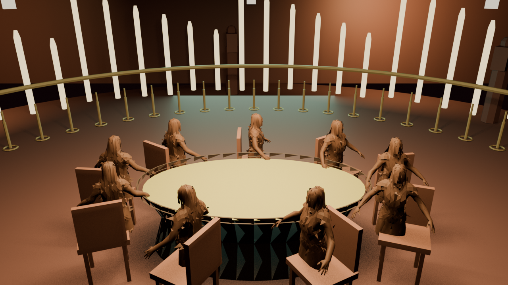
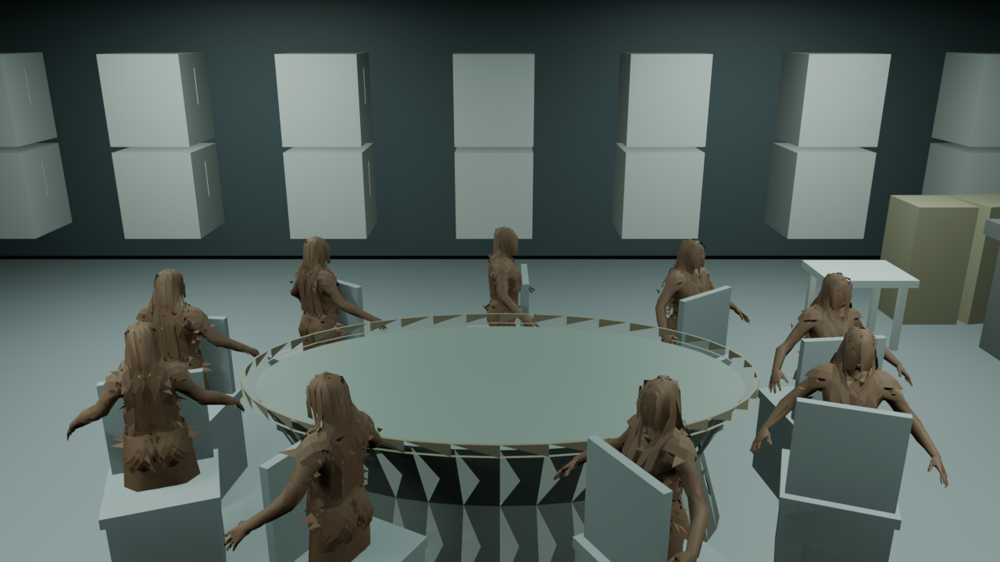

# Progress

A record of how River was actually built, including the parts that went wrong.

Captures live in `progress/`. They are numbered in the order they were taken,
not in the order that flatters the project.

---

## The room that was not empty

The Rooftop venue rendered as a bare cream disc from every camera angle, in
Blender and in the browser. The table, nine seated characters, chairs and chips
were all verified present, correctly positioned, with the right materials in
the published file.

Three cameras, three renders, same result — including one shot where the table
sat mathematically dead centre at 3.74m, filling sixty percent of frame width,
and did not appear.

The first hypothesis was lighting. Every published venue did carry a leaked
glTF point light at intensity 54,351, left behind by an old character import,
which blew the browser view past white. That was real and it was fixed. It was
not this.

Switching to Workbench, which renders geometry with flat shading and ignores
lighting entirely, produced the same disc:

That ruled out lighting completely and showed the shape for what it was: a disc
sitting on a cylindrical wall. Not the terrace floor at z=-0.02. A lid at the
top of the parapet.

`cylinder()` in `art/pipeline/geo.py` took a `closed_bottom` flag and **always
closed the top**. `parapet_ring()` was therefore building a solid 3.9m disc at
z=1.1 across the whole terrace, sealing everything underneath it.

One parameter later:

Nine characters seated around a dark felt oval, terrace, parapet, planters and
skyline. First time anyone had seen the room.

## Judging a room you can finally see

With the venue visible, three props were obviously wrong — and two of them were
mistakes made while trying to follow the spec.

**The white hexagons at head height**, which read as characters with blank
faces, were the fire bowls: a six-segment sphere at emissive strength 3, clipped
to pure white by the tone curve.

**The string lights and palms were floating outside the venue.** The build spec
places them at 8.40m and the palms at 8.40m, but those radii assume a terrace
scaled 1.62x that the pipeline never applies. On a 4.0m terrace they hung in
open air past the parapet.

**A full-height palm cannot coexist with a 6.1m camera orbit on a 4m terrace.**
Its crown either crosses the camera path or stands in front of the table. The
clear-radius gate caught it for the third time in this project; the first time,
it had cost three diagnostic passes chasing "black shadow wedges" that turned
out to be a camera orbiting inside foliage.

Braziers with flames in them, string lights ringing inside the parapet at 2.62m
where they clear the sight line, short potted palms, and every emissive under
the clip point.

## The three venues, as they stand

Every frame below is a Blender render from committed pipeline code. The full set
with per-image notes is in `progress/README.md`.

The Suite is the strongest of the three: warm chandelier key, a balustrade with
turned balusters and a handrail, dining chairs with crest rails. The balusters
blowing out to white pillars is the one thing spoiling it.

The Laundromat reads clearly - machine banks along the wall, counter, cool
fluorescent strips against a single soft shadow caster. It is also the frame
that shows the character work most honestly: no faces, hair as jagged stringy
geometry, and arms sitting close to a T-pose rather than resting on the table.

## The native gold character vertical slice

The character work moved from placeholder geometry to one authored, reproducible
female source between 30 August and 1 September 2026. The source is an MPFB
human with a shared 137-bone rig and export-safe facial shapes. The proof recipe
keeps the real skin, dress, eye, brow, lash and controlled-ponytail assets; it
does not paint a face over a generic body or multiply an unapproved character
across the table.

The local proof set is regenerated by the scripts in `art/pipeline/` and lives
under the ignored `art/out/proofs/native-gold/` directory. It includes the
front, three-quarter, profile and seated source views plus the expression sheet
and the Rooftop integration checks. The browser serves the resulting asset from
`apps/web/public/assets/rooftop_assets.glb`; generated proof images are kept out
of the public repository by design.

The current isolated Rooftop export is 58,110 triangles, 30 materials, 46 draw
calls and 6,096 KB. Chrome shows the gold character in the Rooftop with the
source textures intact and both eyes judgeable from the approved orbit views.
This is a foundation milestone, not F3A acceptance.

The remaining visual work is deliberately narrow: match corneal occlusion and
gameplay lighting, decide whether the temple transition needs a source edit,
finish the red-dress couture termination, and replace the scaffold motion with
the authored poker deltas. Only after those checks and Zain's acceptance does
the recipe expand to the rest of the cast. The Laundromat and Executive Suite
remain deferred.

## Earlier open items, now historical

The old list below described the placeholder era. Characters no longer lack
faces, the jagged hair shells are no longer the active source, and the Rooftop
table/chair/terrace line has already passed its named visual review. The venue's
62-percent scale note remains useful historical context for why prop radii are
defined against the built terrace rather than copied blindly from an earlier
spec.
