# Progress

A record of how River was actually built, including the parts that went wrong.

Captures live in `progress/`. They are numbered in the order they were taken,
not in the order that flatters the project.

---

## The room that was not empty

The Rooftop venue rendered as a bare cream disc from every camera angle, in
Blender and in the browser. The table, nine seated characters, chairs and chips
were all verified present, correctly positioned, with the right materials in
the published file.

Three cameras, three renders, same result — including one shot where the table
sat mathematically dead centre at 3.74m, filling sixty percent of frame width,
and did not appear.

The first hypothesis was lighting. Every published venue did carry a leaked
glTF point light at intensity 54,351, left behind by an old character import,
which blew the browser view past white. That was real and it was fixed. It was
not this.

Switching to Workbench, which renders geometry with flat shading and ignores
lighting entirely, produced the same disc:

That ruled out lighting completely and showed the shape for what it was: a disc
sitting on a cylindrical wall. Not the terrace floor at z=-0.02. A lid at the
top of the parapet.

`cylinder()` in `art/pipeline/geo.py` took a `closed_bottom` flag and **always
closed the top**. `parapet_ring()` was therefore building a solid 3.9m disc at
z=1.1 across the whole terrace, sealing everything underneath it.

One parameter later:

Nine characters seated around a dark felt oval, terrace, parapet, planters and
skyline. First time anyone had seen the room.

## Judging a room you can finally see

With the venue visible, three props were obviously wrong — and two of them were
mistakes made while trying to follow the spec.

**The white hexagons at head height**, which read as characters with blank
faces, were the fire bowls: a six-segment sphere at emissive strength 3, clipped
to pure white by the tone curve.

**The string lights and palms were floating outside the venue.** The build spec
places them at 8.40m and the palms at 8.40m, but those radii assume a terrace
scaled 1.62x that the pipeline never applies. On a 4.0m terrace they hung in
open air past the parapet.

**A full-height palm cannot coexist with a 6.1m camera orbit on a 4m terrace.**
Its crown either crosses the camera path or stands in front of the table. The
clear-radius gate caught it for the third time in this project; the first time,
it had cost three diagnostic passes chasing "black shadow wedges" that turned
out to be a camera orbiting inside foliage.

Braziers with flames in them, string lights ringing inside the parapet at 2.62m
where they clear the sight line, short potted palms, and every emissive under
the clip point.

## The three venues, as they stand

Every frame below is a Blender render from committed pipeline code. The full set
with per-image notes is in `progress/README.md`.

The Suite is the strongest of the three: warm chandelier key, a balustrade with
turned balusters and a handrail, dining chairs with crest rails. The balusters
blowing out to white pillars is the one thing spoiling it.

The Laundromat reads clearly - machine banks along the wall, counter, cool
fluorescent strips against a single soft shadow caster. It is also the frame
that shows the character work most honestly: no faces, hair as jagged stringy
geometry, and arms sitting close to a T-pose rather than resting on the table.

## The native gold character vertical slice

The character work moved from placeholder geometry to one authored, reproducible
female source between 30 August and 1 September 2026. The source is an MPFB
human with a shared 137-bone rig and export-safe facial shapes. The proof recipe
keeps the real skin, dress, eye, brow, lash and controlled-ponytail assets; it
does not paint a face over a generic body or multiply an unapproved character
across the table.

The local proof set is regenerated by the scripts in `art/pipeline/` and lives
under the ignored `art/out/proofs/native-gold/` directory. The strongest review
frames are curated into `docs/progress/` so a fresh checkout can see the
progression; the full generated output remains local. The browser serves the
resulting asset from `apps/web/public/assets/rooftop_assets.glb`.

<table>
<tr>
<td>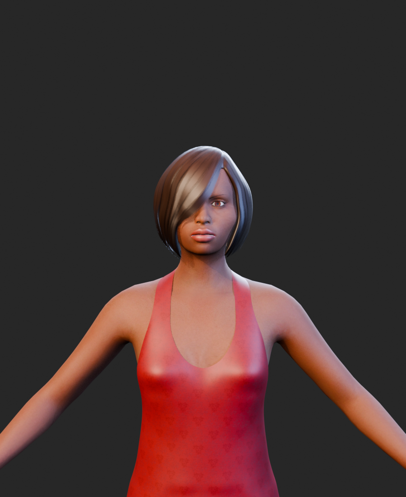</td>
<td>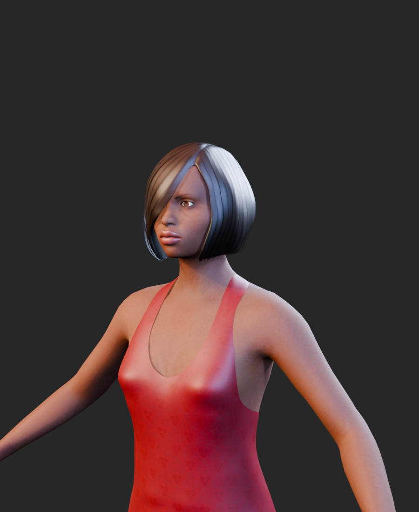</td>
<td>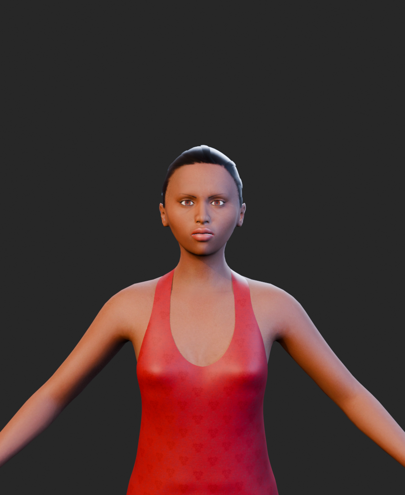</td>
</tr>
<tr>
<td>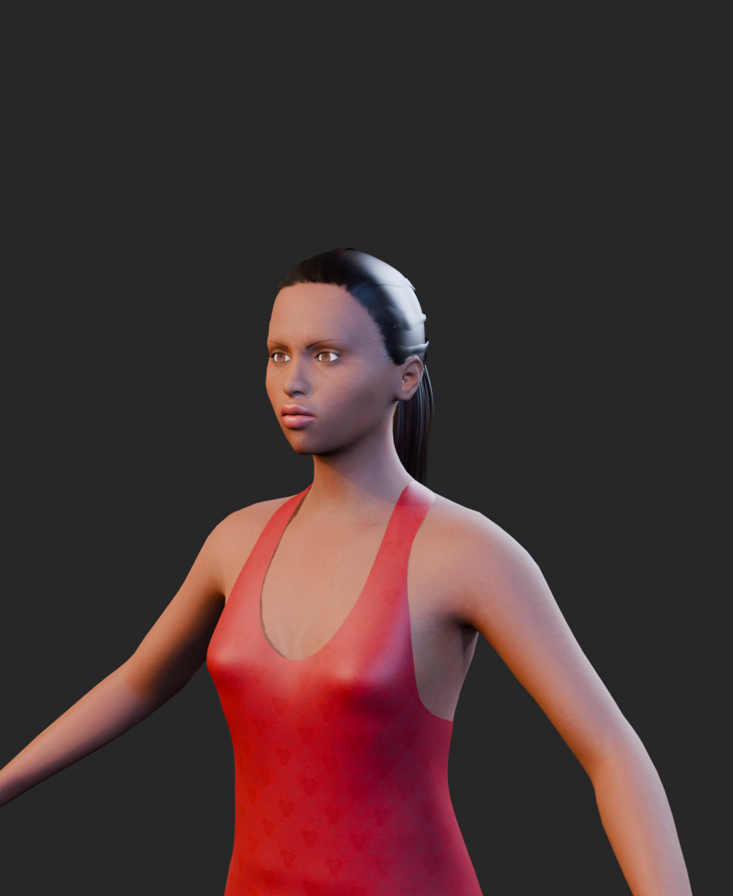</td>
<td>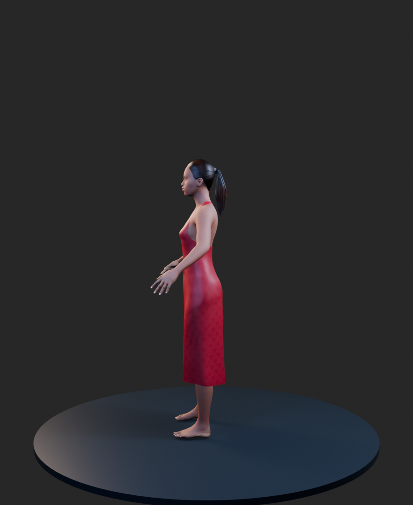</td>
<td>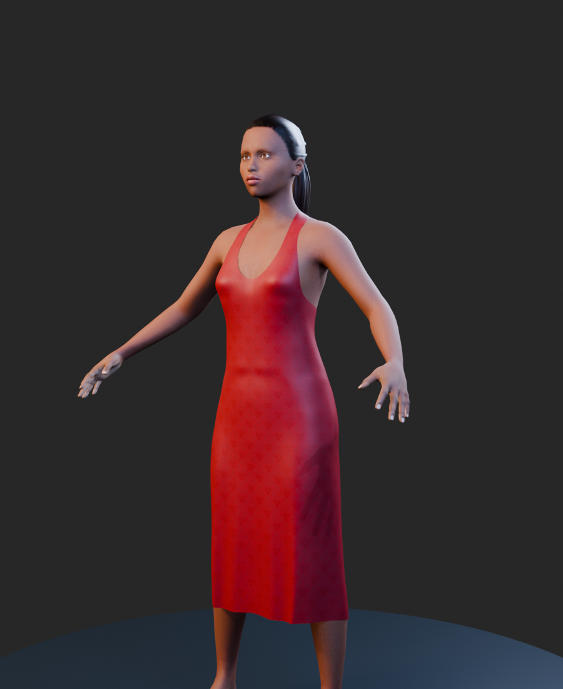</td>
</tr>
<tr>
<td>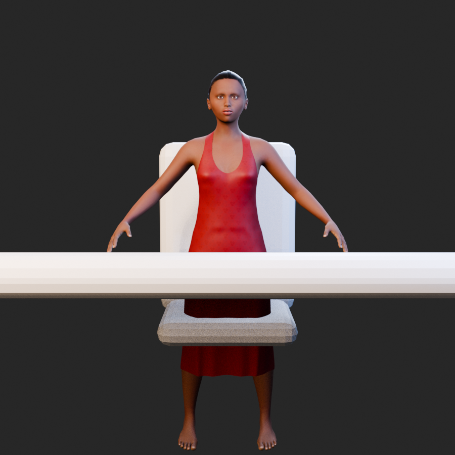</td>
<td>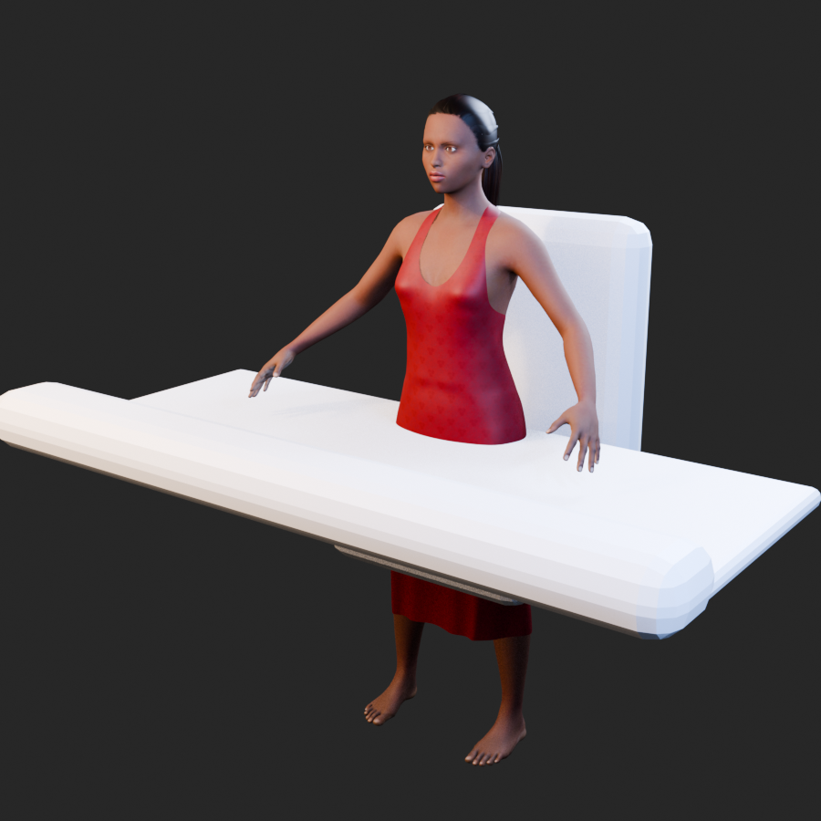</td>
<td>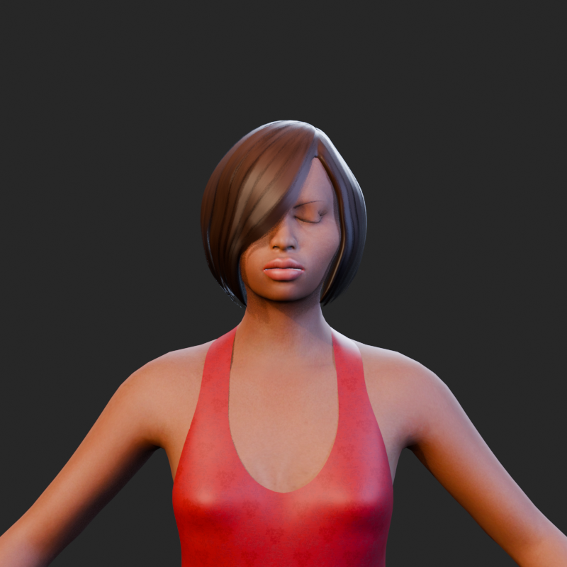</td>
</tr>
<tr>
<td></td>
<td></td>
<td colspan="1">The paired baseline and current portraits show the hair/material change; the seated and expression frames prove the source is being prepared for play rather than only a portrait.</td>
</tr>
</table>

The current isolated Rooftop export is 58,110 triangles, 30 materials, 46 draw
calls and 6,096 KB. Chrome shows the gold character in the Rooftop with the
source textures intact and both eyes judgeable from the approved orbit views.
This is a foundation milestone, not F3A acceptance.

The remaining visual work is deliberately narrow: match corneal occlusion and
gameplay lighting, decide whether the temple transition needs a source edit,
finish the red-dress couture termination, and replace the scaffold motion with
the authored poker deltas. Only after those checks and Zain's acceptance does
the recipe expand to the rest of the cast. The Laundromat and Executive Suite
remain deferred.

## The silver male, and the pose that moved to a person

Silver is the male counterpart to the gold character: the same MPFB source
method, with his own identity, black-tie wardrobe and motion. Between 4 and 13
September he went from a source builder to a seated, animated character in the
Rooftop, gained a tailored black-tie wardrobe that is still in review, and
became the reason River's character art is now posed by hand.

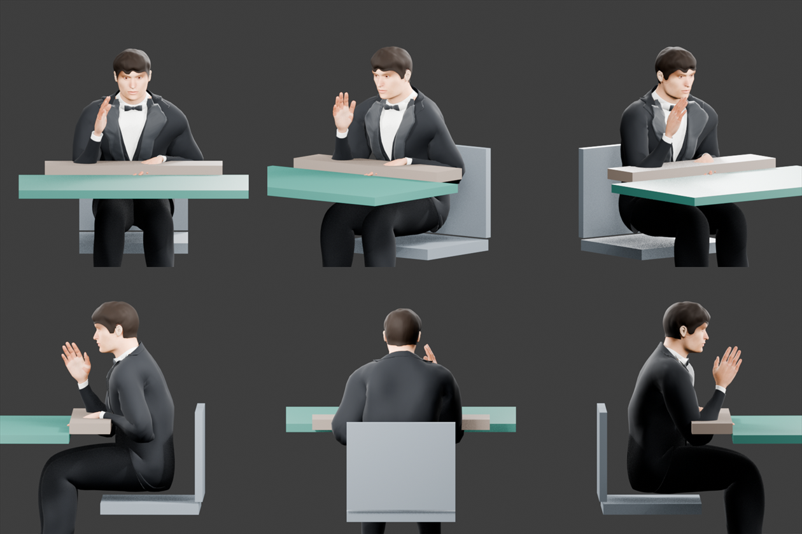

**Seated and moving in the room (4-7 September).** The character pipeline bakes
the seated pose into the mesh rather than leaving it in a pose something
downstream can reset, sizes him against the furniture, solves the rail's
geometry to put the hands on it, and keeps every mesh skinned so the suit and
hair follow the body. The published Rooftop carries one skin over 137 joints
and nine clips, read out of the GLB rather than judged by eye. A camera pointed
at the back of his head for the first time showed the hair shell buried inside
the skull; the conform was rewritten to project onto the skull at the shell's
own measured standoff, and the rebuilt venue shipped with the back of the head
covered.

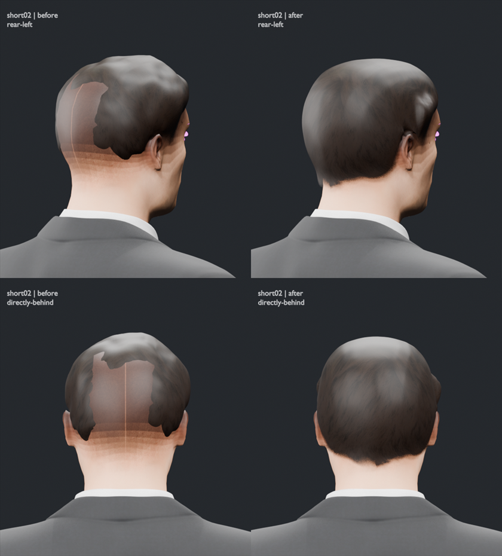

**Black tie (8-10 September).** Astra replaced the stock suit with authored
garments and took the result through repair, a triangle budget closed at
exactly 40,000, and a lighting and material finish. That standing state, A11,
was accepted.

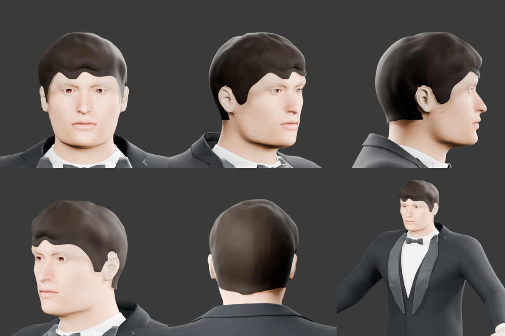

**Seated black tie (10 September).** A jacket tailored to stand up does not
survive sitting down. Carried into the seated pose, it opened at both shoulders
and armholes from behind, and local corrections to the standing garment traded
one fault for another. This is the one wrong frame kept from that stretch,
because it is the frame that decided it:

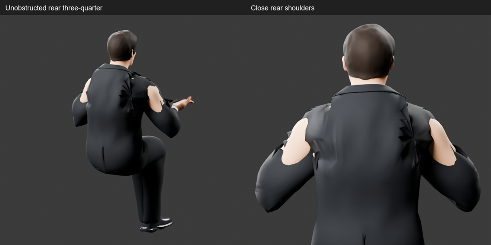

The answer was a seated state of its own rather than more correction of the
standing one. A22, in the default seated pose with the shoulders covered, was
accepted as the base to pose from.

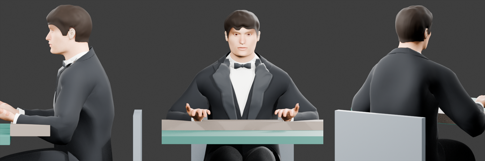

**Posing, and the move to the hand (11-13 September).** Further passes worked
toward a relaxed, supported poker rest with the forearms carried by the rail;
none was accepted. A38b, a centred hand-over-hand rest, was the last candidate a
lane produced.

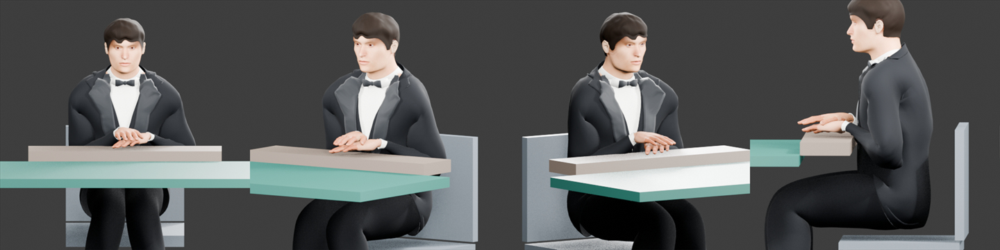

Zain then opened A38b and worked it directly: bones posed by hand, edges
smoothed in sculpt mode, a corrective shape key on the jacket at the right
armpit. Zain found that far quicker and cheaper than briefing another pass, and characters are now posed
and fitted by hand with the models measuring, rendering and gating around that
work. The reasoning is in `DECISIONS.md`. Frame 46 above is that file, rendered
on 13 September. It is work in progress rather than an accepted pose, and it
cannot be regenerated from the repository: its source is a hand-worked `.blend`
kept locally.

**Open, and visible in these frames.**

- No seated poker pose is accepted yet. In A38b the true side shows the forearms
  rising toward the hands rather than resting on the rail.
- The black-tie wardrobe is not in the served venue. The Rooftop the browser
  loads carries the earlier pipeline suit.
- The A11 jacket was built on salvaged donor topology released under CC-BY, so
  its attribution has to ship with any asset derived from it.

## Amber

Amber is a second seated character, built by DeepSeek through an iterative
generation loop and regenerable from `art/pipeline/build_native_amber.py`. It is
an isolated proof: legible at gameplay distance, and not yet in the venue. The
builder's own report names what is still open - a pale band in the V between the
roll-neck and the chest, two small wings where the collar meets the lapel notch,
and specular highlights on both deltoids.

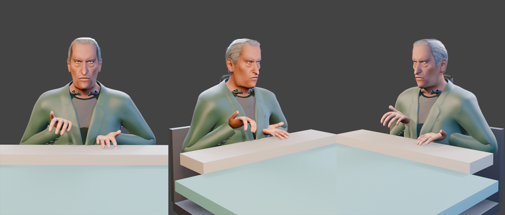

A third character, Bronze, has been started and will continue. There is no
capture of it yet.

## The table, dressed

On 19 September, with Codex carrying Gold's animation, Claude took the venue:
the table first, then the skyline, the terrace and the lighting. The table is in
frame for the whole of a game and it read as a dark hole in the middle of the
room - a flat navy oval with one gold line, a rail that rendered as hard black
bands, and nothing on the dealer's side. It now has a printed felt, a rounded
rail and a dealer's station, and nothing a character sits against has moved.

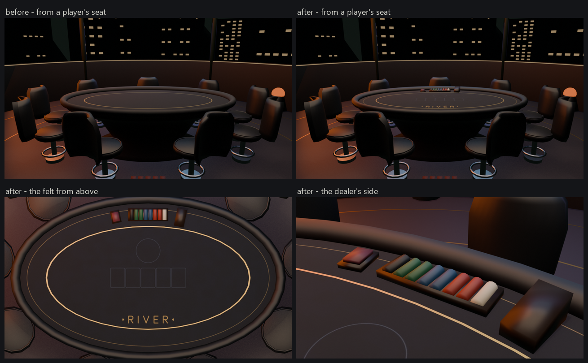

**The felt is printed**, the way a card room prints its layout: boxes where the
browser deals the board, a ring where it stacks the pot, a pinstripe inside the
rail, and the game's name in gold across the felt from the dealer.
`art/pipeline/felt.py` draws it from signed distance fields - the lettering too,
stroke by stroke, so the repository carries no font - and produces the same
image on every build. It ships as a 2048-pixel JPEG of about 110 KB, because
the cloth's grain is noise and noise costs 1.6 MB as a PNG. The build reads the
saved file back and fails if it has drifted from what was drawn.

**The rail is rounded.** Its cross-section turns through more than the 35
degrees the build smooths across, so its shading broke into a band at every
ring of the mesh. Smoothing across those rings changes normals and nothing
else, which is the point: Silver's seats are placed by measuring the rail, and
every seat anchor and chair in the new file is identical to the old one's.

**The dealer has a station**: a chip rack against the rail, sorted high to low,
with the shoe and the discard holder either side, drawn in materials the scene
already had. The Rooftop is 21,158 triangles, 24 materials, 41 draw calls and
582 KB with all of it.

These frames come from `art/pipeline/render_venue_review.py`, which renders the
exported GLB - the file the browser loads, not the scene that made it - under
the venue's own lighting sidecar. A gameplay frame shows the felt at a few dozen
pixels, which is too few to judge a print by.

**Open, and visible in these frames.**

- From a player's seat the board boxes and the pot ring disappear; only the
  wordmark and the pinstripe carry. The ink was drawn quiet on purpose and may
  need lifting once it is judged in the browser at play distance.

## The city around the table

The skyline is the other half of the frame, and it had been built for the wrong
camera. A seated player sees the city through a strip of sky about ten degrees
deep: the parapet cuts the view three degrees under the horizon and the play
camera's frame ends six degrees above it. The old towers stood twenty to
forty-five metres out and rose past fifty degrees, so the strip held the blank
middles of a ring of boxes and a scatter of window bars, and never a rooftop.
Claude rebuilt it the same day as the table, for the strip.

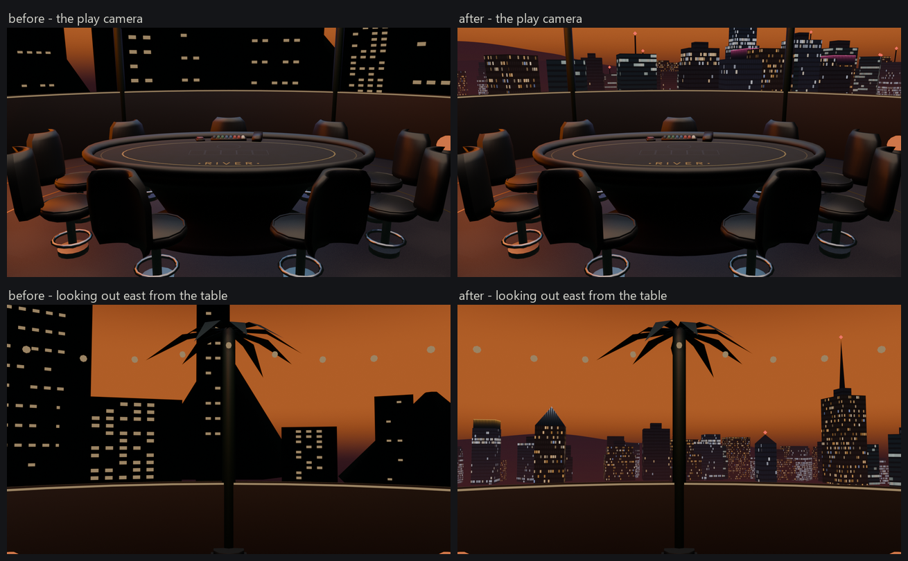

**Towers where real ones would stand.** `art/pipeline/skyline.py` places three
rings of towers from 260 to 820 metres out at real sizes, and sets each top by
the elevation it reaches from the table rather than by a height. Most tops sit
low in the strip so the dusk glow shows above them; one landmark in each of
three clusters leaves the default frame and comes back into it when the orbit
flattens; ridges of hills close part of the horizon. The crowns vary -
setbacks, penthouses, lit bands in four colours, pyramids, spires, and masts
with aircraft warning lights, which the browser flashes thirty times a minute.

**Windows painted, not modelled.** Every facade samples one 2048-pixel atlas in
world units - four texels a metre, a storey every fifteen - so a window is the
same size on every building, and each tower shifts its floors by a phase of
its own so neighbours never share a floor line. The atlas holds four facade
styles at three depths of haze, thicker toward the ground, which is what
separates the rings. The city is emission rather than a lit surface, because
no lamp in the rig reaches two hundred metres; all of it is one mesh and one
draw call on a 160 KB PNG the pipeline writes itself. The Rooftop is 18,230
triangles, 25 materials, 40 draw calls and 933 KB after it - fewer triangles
than before, because the old skyline modelled every lit window as a box.

**Judged against the browser's sky.** The sky dome is a shader in the scene
component, not part of the venue, so `render_venue_review.py` reads the dome's
colours and bands out of that component and draws the same sky behind the city,
at the play camera's field of view. Both frames above come from that script,
run on the table pass's file and on this one.

Two instruments were measuring the wrong thing, and the new city exposed both:

- The parapet's lit edge was the parapet ring squashed to five centimetres by
  its node's scale. The palette gate reads meshes rather than the scene, and
  while the old window boxes shared the edge's material their distance pulled
  it out of the room. Without them the gate counted a lit wall the size of the
  parapet and failed the room. The band is built at its own height now and
  draws pixel for pixel as it did.
- The front-door menu still rendered with Blender's default hundred-metre
  camera, which would have cut the whole city out of it, and hid the chip and
  card pools by name without reaching the meshes Blender imports each instance
  as - five card backs have lain on the floor in every still. Both are fixed and
  the still is regenerated from the current venue.

**Open, and visible in these frames.**

- Every face of a tower is the same brightness, because the city is painted
  rather than lit. Its form comes from the window grid alone, and nothing
  catches the glow on the side that faces it.
- At play distance the lit crown bands read as flat colour; their fins only
  show close up.

## Earlier open items, now historical

The old list below described the placeholder era. Characters no longer lack
faces, the jagged hair shells are no longer the active source, and the Rooftop
table/chair/terrace line has already passed its named visual review. The venue's
62-percent scale note remains useful historical context for why prop radii are
defined against the built terrace rather than copied blindly from an earlier
spec.
