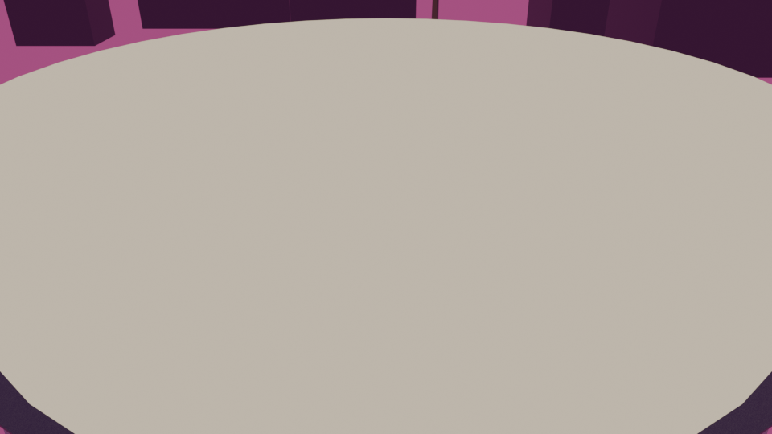
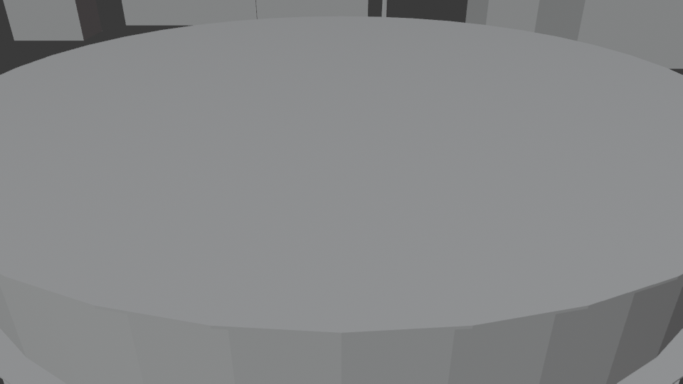
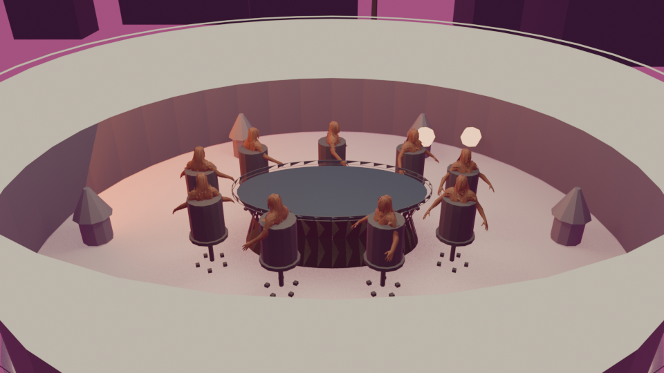
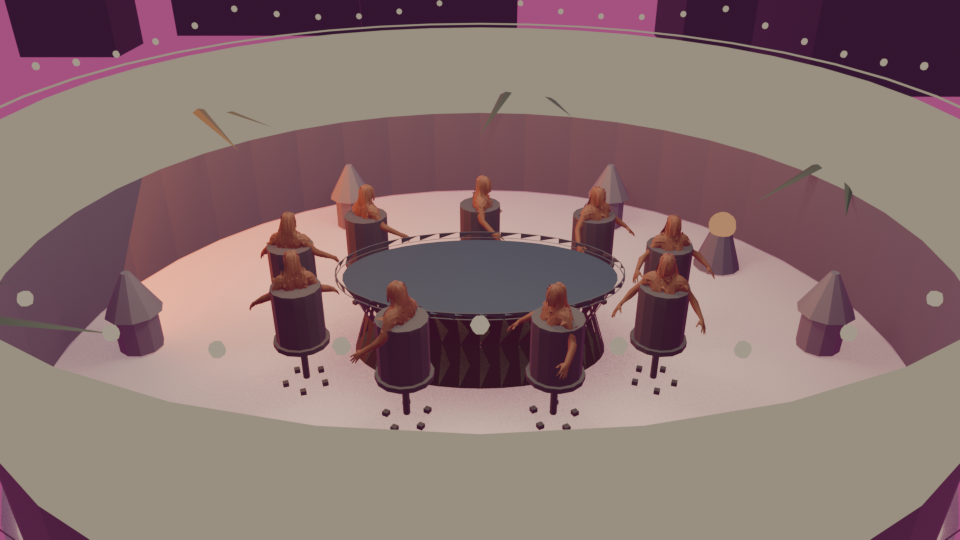

# Progress

A record of how River was actually built, including the parts that went wrong.

Captures live in `progress/`. They are numbered in the order they were taken,
not in the order that flatters the project.

---

## The room that was not empty

The Rooftop venue rendered as a bare cream disc from every camera angle, in
Blender and in the browser. The table, nine seated characters, chairs and chips
were all verified present, correctly positioned, with the right materials in
the published file.

Three cameras, three renders, same result — including one shot where the table
sat mathematically dead centre at 3.74m, filling sixty percent of frame width,
and did not appear.

The first hypothesis was lighting. Every published venue did carry a leaked
glTF point light at intensity 54,351, left behind by an old character import,
which blew the browser view past white. That was real and it was fixed. It was
not this.

Switching to Workbench, which renders geometry with flat shading and ignores
lighting entirely, produced the same disc:

That ruled out lighting completely and showed the shape for what it was: a disc
sitting on a cylindrical wall. Not the terrace floor at z=-0.02. A lid at the
top of the parapet.

`cylinder()` in `art/pipeline/geo.py` took a `closed_bottom` flag and **always
closed the top**. `parapet_ring()` was therefore building a solid 3.9m disc at
z=1.1 across the whole terrace, sealing everything underneath it.

One parameter later:

Nine characters seated around a dark felt oval, terrace, parapet, planters and
skyline. First time anyone had seen the room.

## Judging a room you can finally see

With the venue visible, three props were obviously wrong — and two of them were
mistakes made while trying to follow the spec.

**The white hexagons at head height**, which read as characters with blank
faces, were the fire bowls: a six-segment sphere at emissive strength 3, clipped
to pure white by the tone curve.

**The string lights and palms were floating outside the venue.** The build spec
places them at 8.40m and the palms at 8.40m, but those radii assume a terrace
scaled 1.62x that the pipeline never applies. On a 4.0m terrace they hung in
open air past the parapet.

**A full-height palm cannot coexist with a 6.1m camera orbit on a 4m terrace.**
Its crown either crosses the camera path or stands in front of the table. The
clear-radius gate caught it for the third time in this project; the first time,
it had cost three diagnostic passes chasing "black shadow wedges" that turned
out to be a camera orbiting inside foliage.

Braziers with flames in them, string lights ringing inside the parapet at 2.62m
where they clear the sight line, short potted palms, and every emissive under
the clip point.

## Still open

- Characters read as figures in barrels; the head and hair geometry needs work.
- Chairs are plain drums rather than the swivel chairs the spec describes.
- The venue is built at roughly 62 percent of its designed scale. Every prop
  radius in the build spec is therefore wrong for the pipeline. Either the
  venues scale up or the spec is amended, but two sources of truth for the same
  number is exactly how the floating-lights bug happened.
